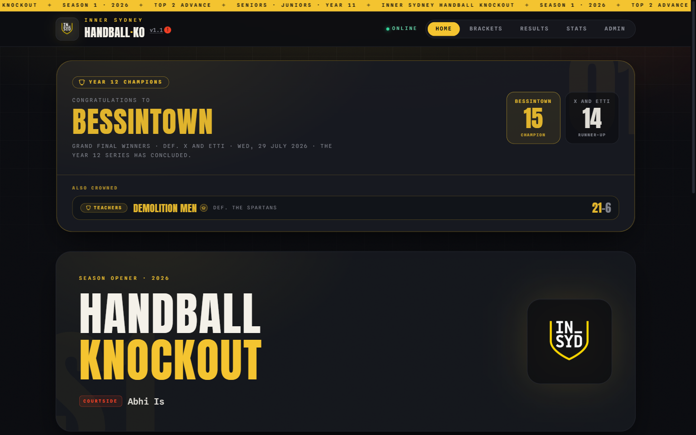
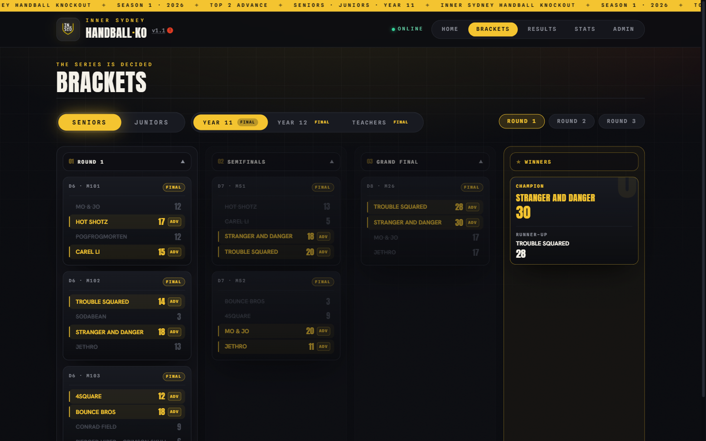
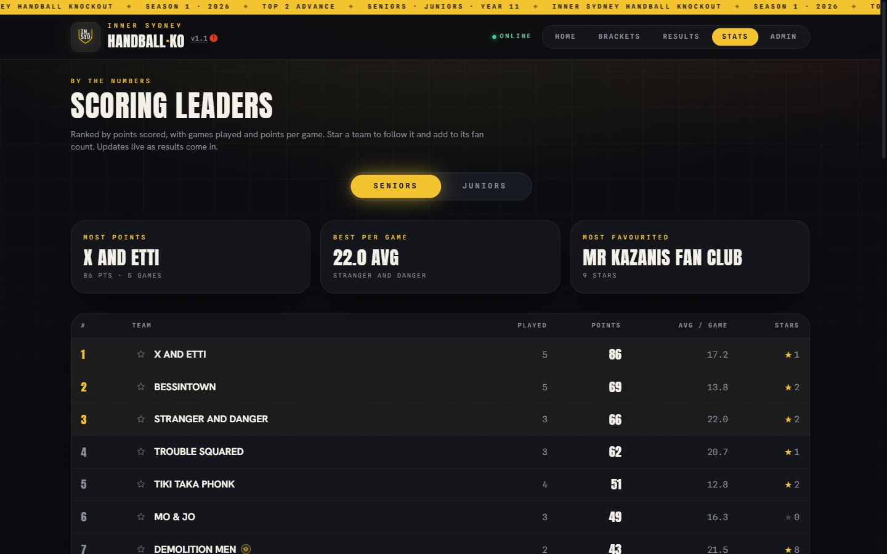

# insydsport

Live tournament platform for the Inner Sydney High School handball knockout. Real-time scoring, bracket trees, standings, and an admin console for the organiser.

**Live at [insydsport.live](https://insydsport.live)**



<p align="center">
  
  
</p>

## What it is

The handball comp was being run off a paper draw and a group chat. Nobody could tell who was playing next or what the score was. 70 teams registered, 67 student duos from Year 7 through Year 12 plus three staff teams, which is more than a whiteboard holds.

This site runs the whole thing. Players check their next match on their phone, a screen in the quad shows live scores, and the organiser updates results from an admin panel as games finish. Everything syncs through Supabase realtime, so a score entered courtside shows up on every open device about a second later.

Because it ran a real event, it had to survive things that never come up in a school assignment. Patchy school wifi. A phone locking mid-match. Someone opening DevTools to see whether they could edit their own score.

## Features

Three senior knockout series run independently on the same bracket: the Year 12 draw (5 rounds, concluded, won by Bessintown), the Year 11 draw (3 rounds), and a staff draw. Teacher teams are admin-only, hidden from every public view until an organiser slots them into a match. The junior bracket runs a round-robin ladder on points and games played instead.

On top of that:

- Live scoring with increment and undo, a live indicator, and animated score changes
- A bracket tree that renders rounds, byes and progression
- Follow a team and get notified when it plays. Follows are counted per device and surface as crowd favourites on the stats page
- Announcements posted by the organiser as dismissible banners, pushed live to every open client
- A stripped-back view at `/screen` for a projector or TV
- A day override, so the organiser can force the schedule to a given day when the real calendar slips. It slipped.

## Stack

Next.js 15 (App Router), React 19, TypeScript, Tailwind, Framer Motion, Supabase for Postgres and realtime, deployed on Netlify.

Server logic sits in route handlers under `app/api/`: `state` for the public read, `admin/auth` for login, `admin/matches` for score writes, `admin/reset-seed` for a full reseed, `stars` for follows, and `bootstrap` for first-run setup.

## Security

This is the part I spent the most time on, mostly because the first version was wrong.

The Supabase anon key ships to the browser. That is how the client is meant to work, but it means anyone who opens DevTools is holding a database key. For the first ten commits there was no Row Level Security, so that key could read, edit and delete every row directly, straight past the admin password. A student could have wiped the tournament from the browser console.

The fix lives in `supabase/rls.sql` and the per-feature SQL files:

- RLS is enabled on every table. `teams`, `matches`, `app_settings` and `notifications` get a public read policy and nothing else, so the anon key is read-only.
- `team_stars` has RLS enabled with no policies at all, so the public key can neither read it nor write it. Follows go through the server instead.
- Server writes use the service role key, which bypasses RLS. `lib/supabase.ts` keeps the browser client and the server client in separate functions so that key cannot end up in a bundle.

Admin auth is in `lib/admin-auth.ts`. The password comes from `ADMIN_PASSWORD` and is never hardcoded, so it stays out of the repo and out of git history. It also fails closed: if the variable is missing, `isAdminPassword` returns `false` and every admin request is denied. A broken deploy locks the organiser out rather than letting everyone in. The obvious alternative, falling back to a default password when the variable is unset, is how you end up with an admin panel open to the internet.

`lib/rate-limit.ts` throttles failed admin logins. Five failures inside a rolling fifteen minute window triggers a fifteen minute block, keyed on `x-forwarded-for`. A correct password wipes the record immediately, so it never gets in the organiser's way.

Follows are deduplicated in the database rather than the client. `team_stars` has a composite primary key of `(device_id, team_id)`, so re-sending a follow is a no-op and the public endpoint cannot be looped to inflate a count. `teams.star_count` is maintained by a trigger in the same transaction as the insert, so concurrent follows take a row lock on the team and the count cannot drift from the underlying rows.

Player names are truncated to a first name and a surname initial by `displayPlayerName` in `lib/tournament-utils.ts`, applied server-side in `/api/state` so the full names never reach the browser.

## The score journal

Scores go to Supabase. Sometimes Supabase does not get them, because school wifi.

`lib/score-journal.ts` writes every scoring action to the scoring device's localStorage the moment it happens, independently of the network write. Failed writes stay flagged `synced: false` so they can be retried, and the whole log exports to CSV so the organiser keeps a paper trail.

The reasoning is simple enough that it took me an embarrassingly long time to get there: a backup that lives in the same database is not a backup.

## Tradeoffs I took on purpose

The rate limiter is in-memory. On Netlify each serverless instance keeps its own counters and they reset on a cold start, so it is a soft throttle rather than a hard global guarantee. For a school tournament with one shared password it is enough to stop someone scripting guesses. Anything bigger would need the counters in Postgres or Redis.

The score journal is per-device. The scoring phone is the source of truth, and if that phone disappears the journal goes with it. Syncing journals across devices was more machinery than a five day comp justified.

There are no user accounts. One shared admin password, one organiser. Auth would be the right call for anything larger and the wrong call here.

`is_next_term` is legacy. It is a two-way flag kept in sync with `series === 'year11'`, left in so older rows keep working. `series` is the field to use. If this ran again I would drop it in a migration.

## How this was built

I used AI assistance throughout this build, and I would rather say so than have it inferred. It writes code quickly. It does not decide what the code should do, and on this project that distinction was most of the work.

The Row Level Security gap above is the clearest example. A model will happily hand you a working Supabase client that ships an anon key to the browser, because that code runs and the app looks finished. Knowing that a read-write key in the browser is a hole, and knowing to reach for RLS to close it, was the part I had to bring. The same goes for the fail-closed admin check, keeping the score journal on the device rather than trusting the network, and the decisions about what an organiser actually needs on screen while a match is running. I made those calls, then used AI to get there faster, and I checked what came back because I am the one who has to defend it.

The tournament did the rest. 70 teams on school wifi during live rounds surfaced failure modes I would not have thought to test for, and every fix after launch came from watching people use it rather than from asking a model what might go wrong.

## Running it locally

```bash
npm install
cp .env.local.example .env.local
npm run dev
```

Fill in `.env.local`, then run the SQL files in `supabase/` through the Supabase dashboard SQL editor, starting with `schema.sql` and finishing with `rls.sql`. They are all safe to re-run.

Set `SUPABASE_SERVICE_ROLE_KEY` before you run `rls.sql`. If you enable RLS while the server is still falling back to the anon key, the admin panel stops working and the failure is not obvious from the UI.

## Getting the code

Clone it, or download a ZIP from the [releases page](https://github.com/Squ1dddy/insydsport/releases).
